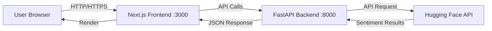

# Sentiment Analysis Application

A full-stack sentiment analysis application built with **FastAPI** (backend) and **Next.js** (frontend). The application uses Hugging Face's sentiment analysis models to classify text as Positive, Negative, or Neutral.

---

## 📋 Table of Contents

- [Features](#-features)
- [Architecture](#-architecture)
- [Prerequisites](#-prerequisites)
- [Quick Start with Docker](#-quick-start-with-docker)
- [Development Setup (Without Docker)](#-development-setup-without-docker)
- [API Documentation](#-api-documentation)
- [Environment Variables](#-environment-variables)
- [Project Structure](#-project-structure)
- [Testing](#-testing)
- [Troubleshooting](#-troubleshooting)
- [Deployment](#-deployment)
- [Contributing](#-contributing)

---

## ✨ Features

- 🔐 **JWT-based Authentication** - Secure token-based authentication system
- 🎭 **Sentiment Analysis** - Powered by Hugging Face's nlptown/bert-base-multilingual-uncased-sentiment model
- 🎨 **Modern UI** - Beautiful interface built with Next.js 14 and Tailwind CSS
- 🐳 **Fully Dockerized** - Easy deployment with Docker Compose
- 🧪 **Test Suite** - Comprehensive backend tests with pytest
- 📱 **Responsive Design** - Works seamlessly on desktop and mobile devices
- 🔄 **Real-time Analysis** - Instant sentiment predictions with confidence scores

---

## 🏗️ Architecture



### Tech Stack

**Frontend:**
- Next.js 14 (App Router)
- React 18
- Tailwind CSS 3
- Axios for API calls

**Backend:**
- FastAPI (Python 3.12)
- Pydantic for data validation
- JWT for authentication
- HTTPX for async HTTP requests
- Uvicorn ASGI server

**AI/ML:**
- Hugging Face Inference API
- Model: `nlptown/bert-base-multilingual-uncased-sentiment`

---

## 📦 Prerequisites

Before you begin, ensure you have the following installed:

### For Docker Setup (Recommended)
- **Docker** (version 20.10 or higher)
- **Docker Compose** (version 2.0 or higher)
- **Git**
- **Hugging Face Account** - [Sign up here](https://huggingface.co/join)

### For Local Development
- **Python 3.12+**
- **Node.js 20+** and **npm**
- **Git**
- **Hugging Face Account**

### Getting Your Hugging Face API Key

1. Go to [huggingface.co](https://huggingface.co)
2. Sign up or log in
3. Navigate to [Settings → Access Tokens](https://huggingface.co/settings/tokens)
4. Click **"New token"**
5. Give it a name (e.g., "sentiment-app")
6. Select **"Read"** role
7. Click **"Generate token"**
8. Copy the token (you won't be able to see it again!)

---

## 🚀 Quick Start with Docker

This is the **easiest and recommended** way to run the application.

### Step 1: Clone the Repository

```bash
git clone https://github.com/saidElamri/emotions.git
cd emotions
```

### Step 2: Create Environment File

Create a `.env` file in the **root directory** (same level as `docker-compose.yml`):

```bash
# Create the .env file
cat > .env << EOF
HF_API_KEY=your_actual_huggingface_api_key_here
EOF
```

> [!IMPORTANT]
> Replace `your_actual_huggingface_api_key_here` with your real Hugging Face API key from the prerequisites step.

### Step 3: Build and Run

```bash
# Build and start all services
docker-compose up --build

# Or run in detached mode (background)
docker-compose up --build -d
```

**First-time build** takes 2-5 minutes depending on your internet speed.

### Step 4: Access the Application

Once the containers are running, open your browser:

- **Frontend**: [http://localhost:3000](http://localhost:3000)
- **Backend API**: [http://localhost:8000](http://localhost:8000)
- **API Docs (Swagger)**: [http://localhost:8000/docs](http://localhost:8000/docs)

### Step 5: Login

Use these demo credentials:
- **Username**: `demo`
- **Password**: `demo_password`

### Managing Docker Containers

```bash
# Stop all services
docker-compose down

# Stop and remove volumes
docker-compose down -v

# View logs
docker-compose logs -f

# View logs for specific service
docker-compose logs -f backend
docker-compose logs -f frontend

# Rebuild after code changes
docker-compose up --build
```

---

## 💻 Development Setup (Without Docker)

For local development with hot-reloading and debugging.

### Backend Setup

1. **Navigate to backend directory:**
   ```bash
   cd sentiment-backend
   ```

2. **Create virtual environment:**
   ```bash
   python3 -m venv venv
   ```

3. **Activate virtual environment:**
   ```bash
   # On Linux/macOS
   source venv/bin/activate
   
   # On Windows
   venv\Scripts\activate
   ```

4. **Install dependencies:**
   ```bash
   pip install -r requirements.txt
   ```

5. **Create `.env` file** in `sentiment-backend/` directory:
   ```bash
   DEMO_USERNAME=demo
   DEMO_PASSWORD=demo_password
   SECRET_KEY=your-super-secret-key-change-this-in-production
   ACCESS_TOKEN_EXPIRE_MINUTES=30
   HF_API_KEY=your_huggingface_api_key_here
   ```

6. **Run the backend:**
   ```bash
   uvicorn app.main:app --reload --host 0.0.0.0 --port 8000
   ```

   The `--reload` flag enables hot-reloading for development.

7. **Verify backend is running:**
   - Visit [http://localhost:8000](http://localhost:8000)
   - Visit [http://localhost:8000/docs](http://localhost:8000/docs) for interactive API docs

### Frontend Setup

1. **Open a new terminal** and navigate to frontend directory:
   ```bash
   cd sentiment-frontend
   ```

2. **Install dependencies:**
   ```bash
   npm install
   ```

3. **Create `.env.local` file** in `sentiment-frontend/` directory:
   ```bash
   NEXT_PUBLIC_API_URL=http://localhost:8000
   ```

4. **Run the frontend:**
   ```bash
   npm run dev
   ```

5. **Access the application:**
   - Visit [http://localhost:3000](http://localhost:3000)

### Development Workflow

- Backend changes auto-reload with `--reload` flag
- Frontend changes auto-reload with Next.js Fast Refresh
- Check terminal logs for errors
- Use browser DevTools for frontend debugging
- Use FastAPI docs at `/docs` for API testing

---

## 📚 API Documentation

### Base URL
- **Development**: `http://localhost:8000`
- **Production**: Your deployed URL

### Authentication

All protected endpoints require a JWT token in the `Authorization` header:
```
Authorization: Bearer <your_jwt_token>
```

### Endpoints

#### 1. **POST** `/login`

Authenticate and receive a JWT token.

**Request Body:**
```json
{
  "username": "demo",
  "password": "demo_password"
}
```

**Response (200 OK):**
```json
{
  "access_token": "eyJhbGciOiJIUzI1NiIsInR5cCI6IkpXVCJ9...",
  "token_type": "bearer"
}
```

**Error Responses:**
- `401 Unauthorized` - Invalid credentials

---

#### 2. **POST** `/predict`

Analyze sentiment of provided text. **Requires authentication.**

**Request Headers:**
```
Authorization: Bearer <your_jwt_token>
Content-Type: application/json
```

**Request Body:**
```json
{
  "text": "I absolutely love this product! It's amazing!"
}
```

**Response (200 OK):**
```json
{
  "sentiment": "Positive",
  "score": 0.9876
}
```

**Possible Sentiment Values:**
- `"Positive"` - 4-5 stars
- `"Neutral"` - 3 stars
- `"Negative"` - 1-2 stars

**Error Responses:**
- `400 Bad Request` - Empty text
- `401 Unauthorized` - Missing or invalid token
- `502 Bad Gateway` - Hugging Face API error
- `504 Gateway Timeout` - Connection timeout

---

#### 3. **GET** `/`

Health check endpoint.

**Response (200 OK):**
```json
{
  "message": "Welcome to the Sentiment Analysis API. Post to /login or /predict."
}
```

---

### Interactive API Documentation

FastAPI provides automatic interactive documentation:

- **Swagger UI**: [http://localhost:8000/docs](http://localhost:8000/docs)
- **ReDoc**: [http://localhost:8000/redoc](http://localhost:8000/redoc)

You can test all endpoints directly from the browser!

---

## 🔐 Environment Variables

### Root `.env` (for Docker Compose)

```bash
# Hugging Face API Key (REQUIRED)
HF_API_KEY=hf_xxxxxxxxxxxxxxxxxxxxxxxxxxxxx
```

### Backend `.env` (for local development)

```bash
# Demo user credentials
DEMO_USERNAME=demo
DEMO_PASSWORD=demo_password

# JWT secret key (change in production!)
SECRET_KEY=your-super-secret-key-min-32-characters-long

# Token expiration time (in minutes)
ACCESS_TOKEN_EXPIRE_MINUTES=30

# Hugging Face API Key (REQUIRED)
HF_API_KEY=hf_xxxxxxxxxxxxxxxxxxxxxxxxxxxxx
```

### Frontend `.env.local` (for local development)

```bash
# Backend API URL
NEXT_PUBLIC_API_URL=http://localhost:8000
```

> [!WARNING]
> **Never commit `.env` files to Git!** They contain sensitive information. The `.gitignore` is already configured to exclude them.

---

## 📁 Project Structure

```
emotions/
├── sentiment-backend/              # FastAPI Backend
│   ├── app/
│   │   ├── __init__.py
│   │   ├── main.py                # Main FastAPI application
│   │   ├── auth.py                # JWT authentication logic
│   │   ├── config.py              # Environment configuration
│   │   ├── hf_client.py           # Hugging Face API client
│   │   └── schemas.py             # Pydantic models/schemas
│   ├── tests/
│   │   ├── __init__.py
│   │   └── test_main.py           # Backend tests
│   ├── Dockerfile                 # Backend Docker configuration
│   ├── requirements.txt           # Python dependencies
│   └── pytest.ini                 # Pytest configuration
│
├── sentiment-frontend/             # Next.js Frontend
│   ├── src/
│   │   ├── app/
│   │   │   ├── globals.css        # Global styles
│   │   │   ├── layout.js          # Root layout
│   │   │   ├── page.js            # Home page
│   │   │   ├── login/
│   │   │   │   └── page.js        # Login page
│   │   │   └── sentiment/
│   │   │       └── page.js        # Sentiment analysis page
│   │   ├── components/
│   │   │   ├── Alert.js           # Alert component
│   │   │   ├── Button.js          # Button component
│   │   │   └── Spinner.js         # Loading spinner
│   │   └── lib/
│   │       └── api.js             # API client utilities
│   ├── public/                    # Static assets
│   ├── Dockerfile                 # Frontend Docker configuration
│   ├── package.json               # Node dependencies
│   ├── tailwind.config.js         # Tailwind CSS configuration
│   ├── postcss.config.mjs         # PostCSS configuration
│   └── next.config.mjs            # Next.js configuration
│
├── docker-compose.yml              # Docker Compose orchestration
├── .gitignore                      # Git ignore rules
└── README.md                       # This file
```

---

## 🧪 Testing

### Backend Tests

The backend includes a test suite using **pytest**.

**Run tests:**
```bash
cd sentiment-backend
source venv/bin/activate  # Activate virtual environment
pytest
```

**Run with coverage:**
```bash
pytest --cov=app --cov-report=html
```

**Run specific test:**
```bash
pytest tests/test_main.py::test_login_success -v
```

### Test Coverage

Current tests cover:
- ✅ Login endpoint (success and failure)
- ✅ Sentiment prediction endpoint
- ✅ Authentication middleware
- ✅ Error handling

---

## 🔧 Troubleshooting

### Common Issues

#### 1. **Port Already in Use**

**Error:** `Bind for 0.0.0.0:3000 failed: port is already allocated`

**Solution:**
```bash
# Find process using the port
lsof -i :3000  # or :8000

# Kill the process
kill -9 <PID>

# Or change the port in docker-compose.yml
```

---

#### 2. **Hugging Face API Error**

**Error:** `502 Bad Gateway - Hugging Face API error`

**Possible causes:**
- Invalid API key
- API key not set in `.env`
- Hugging Face API is down
- Rate limit exceeded

**Solution:**
1. Verify your API key is correct
2. Check `.env` file exists and is loaded
3. Visit [Hugging Face Status](https://status.huggingface.co/)
4. Wait a few minutes if rate-limited

---

#### 3. **Frontend Can't Connect to Backend**

**Error:** `Network Error` or `CORS error`

**Solution:**
1. Verify backend is running: `curl http://localhost:8000`
2. Check `NEXT_PUBLIC_API_URL` in frontend `.env.local`
3. For Docker: use service name `http://backend:8000`
4. For local dev: use `http://localhost:8000`

---

#### 4. **Docker Build Fails**

**Error:** Various Docker build errors

**Solution:**
```bash
# Clean Docker cache
docker system prune -a

# Rebuild from scratch
docker-compose build --no-cache

# Check Docker disk space
docker system df
```

---

#### 5. **Module Not Found Errors**

**Backend:**
```bash
cd sentiment-backend
pip install -r requirements.txt
```

**Frontend:**
```bash
cd sentiment-frontend
rm -rf node_modules package-lock.json
npm install
```

---

#### 6. **JWT Token Expired**

**Error:** `401 Unauthorized`

**Solution:** Log in again to get a new token. Tokens expire after 30 minutes by default.

---

### Debug Mode

**Enable backend debug logging:**
```bash
# In sentiment-backend/.env
LOG_LEVEL=DEBUG
```

**View Docker logs:**
```bash
docker-compose logs -f backend
docker-compose logs -f frontend
```

---

## 🌐 Deployment

### Deploy to Production

#### Option 1: Docker Compose (VPS/Cloud VM)

1. **Set up a server** (AWS EC2, DigitalOcean, etc.)

2. **Install Docker and Docker Compose**

3. **Clone repository:**
   ```bash
   git clone https://github.com/saidElamri/emotions.git
   cd emotions
   ```

4. **Create production `.env`:**
   ```bash
   HF_API_KEY=your_production_api_key
   ```

5. **Update `docker-compose.yml` for production:**
   - Change ports if needed
   - Add reverse proxy (Nginx/Traefik)
   - Enable HTTPS with Let's Encrypt

6. **Run:**
   ```bash
   docker-compose up -d
   ```

---

#### Option 2: Separate Deployments

**Backend → Railway/Render/Fly.io:**
- Deploy `sentiment-backend/` folder
- Set environment variables in platform dashboard
- Use platform's provided URL

**Frontend → Vercel/Netlify:**
- Deploy `sentiment-frontend/` folder
- Set `NEXT_PUBLIC_API_URL` to backend URL
- Deploy with automatic builds

---

### Security Considerations for Production

> [!CAUTION]
> Before deploying to production:

1. **Change `SECRET_KEY`** to a strong random value:
   ```bash
   python -c "import secrets; print(secrets.token_urlsafe(32))"
   ```

2. **Use environment-specific `.env` files**

3. **Enable HTTPS** (use Let's Encrypt, Cloudflare, etc.)

4. **Update CORS origins** in `sentiment-backend/app/main.py`:
   ```python
   allow_origins=["https://yourdomain.com"]
   ```

5. **Use a real database** instead of in-memory user storage

6. **Implement rate limiting** to prevent abuse

7. **Set up monitoring** (Sentry, LogRocket, etc.)

8. **Regular security updates**:
   ```bash
   pip install --upgrade -r requirements.txt
   npm update
   ```

---

## 🤝 Contributing

Contributions are welcome! Please follow these steps:

1. **Fork the repository**

2. **Create a feature branch:**
   ```bash
   git checkout -b feature/amazing-feature
   ```

3. **Make your changes**

4. **Run tests:**
   ```bash
   cd sentiment-backend
   pytest
   ```

5. **Commit your changes:**
   ```bash
   git commit -m "Add amazing feature"
   ```

6. **Push to your fork:**
   ```bash
   git push origin feature/amazing-feature
   ```

7. **Open a Pull Request**

---

## 📄 License

This project is for **educational purposes**.


**Happy Analyzing! 🎭✨**
